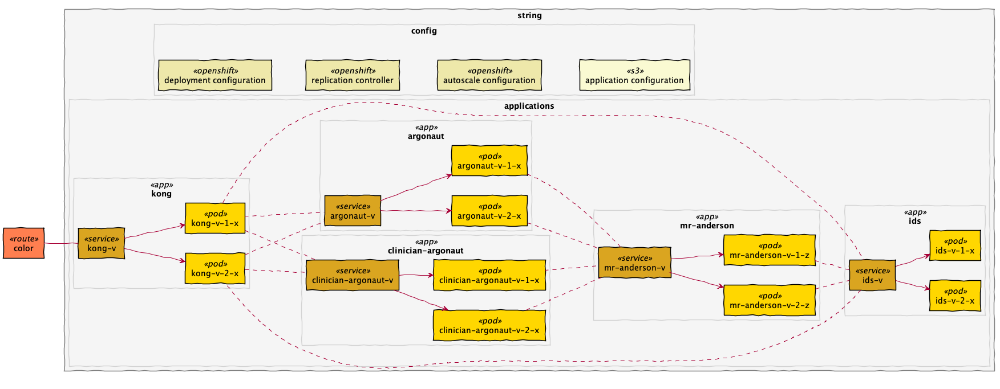
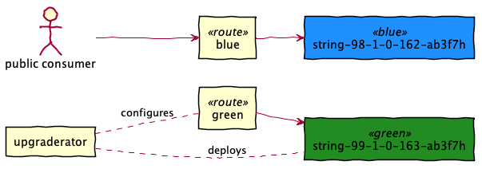

# health-apis-deployer

This project is the home for the 
[Health APIs](https://github.com/department-of-veterans-affairs/health-apis/) CD/CI pipeline.
This pipeline is used for automatic building, testing, and blue-green deployments.
Health APIs consists of the three applications, Argonaut, Mr. Anderson, and Identity Service.

##### Key Concepts
- This Jenkins job produces an _Upgraderator_ Docker image that is contains everything it needs
  to deploy exactly one version of the Health API applications. This includes
  - Application version information
  - OpenShift configuration
  - Application configuration
  - Test suites
- Deployments are uniquely versioned
- Upgraderators include configuration for all environments and are immutable and portable
- Upgraderators can remove the version they installed
- Zero downtime upgrades

##### Version Numbers
Deployments are uniquely numbered using
- The Jenkins the build number
- The Health APIs application version number
- The Git commit has of this repository (which includes configuration)

> For example `99_1_0_163-ab3f7h`, is Jenkins build number `99` for version `1.0.163` of the 
> Health APIs using configuration version `ab3f7h`.

##### Triggers
- a successful jenkins build of the health-apis project
- a manual launch of the deployer jenkins job

----

# Strings
A _String_ represents the complete set of artifacts deployed.

A String consists of
- OpenShift artifacts
  - Deployment configuration
  - Replication controller configuration
  - Horizontal autoscaler configuration
  - Service definitions
- Application docker images running as pods
- Externalized application configuration in S3 for environment-specific details, such as database
  credentials.

Every artifact in the string is uniquely versioned and may only interact with components in it's
string. 
For example, `argonaut-99_1_0_163-ab3f7h` may only communicate with `mr-anderson-99_1_0_163-ab3f7h`.
It cannot communicate with `mr-anderson-98-1-0-162-ab3f7h`. 

##### Routes
Routes live outside of a string, but are affected by deployments. A route represents the ingress 
points of the system. During deployments, routes are reconfigured to direct traffic to new 
deployments. 

----

# Blue-Green
Blue-green deployment is an technique for rolling out production upgrades designed to minimize 
downtime by creating two production environments, _blue_ and _green_. Blue is the currently live
environment that is servicing all traffic. Green is idle or the next version that will become live.

----

Upon receiving this trigger, a unique docker container known as an _Upgraderator_ is built, and pushed to our docker cloud registry.

## Whats an Upgraderator?

An _Upgraderator_ contains the following configurations and functionalities:

##### health-apis version number
...
##### health-apis application.properties
...
##### environment configurations
...
##### openshift deployment-configs
...
##### openshift service-configs
...
##### openshift autoscaling-configs
...
##### template files
...

Upgraderator containers also contains the following scripts that perform the legwork of the CD/CI process:

##### `upgraderator.sh`
...
##### `deleterator.sh`
...
##### `blue-green.sh`
...
